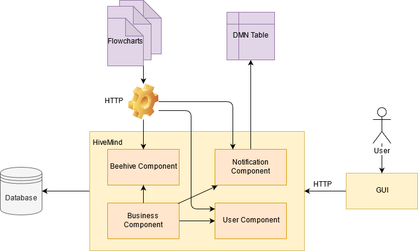

# 3. Architecture

The first step in designing the architecture was to decide which of the components would be the "main character".
Between the "models at runtime" and the server, we decided that the models determine what the server does.  
HiveMind is managed by two different type of models. You will find more information about these are you read through
this chapter.

Below is a picture of HiveMind's architecture.

The **"Sweeter Honey - HiveMind"** application is divided into three main levels:

1. Models At Runtime
2. Back-End
3. Client

The following subsections describe each level in more detail

## 1. Models At Runtime

### 1.1 Flowcharts

Flowcharts were chosen because they depict processes. They are very easy to understand and they are used in order to
document, plan, study and improve different complex processes. Since this project aims to simulate the beehives, their
sensors and how they would behave, flowcharts were chosen.

There are six flowcharts present:

1. **The Initial Setup Flowchart** - it aims to set up the beehives and their attributes while also assigning them to
   users
2. **The Chaos Flowchart** - it aims to "shake up" the beehives in order to create chaos and randomness among their
   attributes.
3. **The Counting of Bee Traffic Flowchart** - it aims to simulate the movement sensor of a beehive. The population of
   the beehive will either grow or shrink depending if the beehive has entered or left the beehive.
4. **The Trigger of the Temperature Sensor** - it aims to simulate the temperature sensor within the beehive. Based on
   the current temperature, the beehive will be aired out or heated.
5. **The Trigger of the Weight Sensor** - it aims to check if the weight of the beehive has reached a certain threshold.
6. **The Trigger of All Sensors** - this last flowchart aims to trigger all sensors for all beehives that are stored
   within the server and to bring them to a normal state.

### 1.2 DMN Table

The DMN Table aims to resolve the aspect of making a decision based on different attributes of the beehive. Based on the
DMN Table, the server will or will not issue an email to the user who is responsible for the beehive. The main
attraction for this, is the fact the DMN Tables are scalable and can be changed whenever. New decisions can be added or
old ones can be deleted or even updated. Through this we avoid the re-compiling of the server (since no code was changed
or added), because the server consults the DMN Table whenever it is necessary.

## 2. Back-End

The backend component encapsulates the server and a database. The database stores information about hives, users who use
the application, which user is responsible for which hive, and Notifications that users may receive. The server is
implemented as a SpringBoot application in the Java programming language. Our decision to use Java and SpringBoot was
made by the fact, that SpringBoot is a great bootstrap for small to medium projects, which also includes many features
and dependencies that make the application development faster and easier. The server once again assumes its role as
the "brain" of the application. It provides methods for querying and editing data while also allowing clients to request
information from the database.

## 3. Client

The client was developed in Angular TypeScript which runs on a NodeJS instance. The Client's role is to offer a visual
interface for the user. The user can register or can log in an existing account. Once logged in the user can look the
status of the beehive they are responsible for, or all of them, and also check their notifications.

